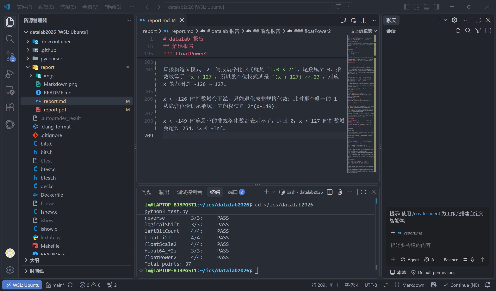

# datalab 报告

姓名：宋佚卓

学号：2025200696

| 总分 | bitAnd | bitXor | samesign | logtwo | byteSwap | reverse | logicalShift | leftBitCount | float_i2f | floatScale2 | float64_f2i | floatPower2 |
| --------- | ------ | ------ | -------- | ------ | -------- | ------- | ------------ | ------------ | --------- | ----------- | ----------- | ----------- |
| 37.00 | 1.00 | 1.00 | 2.00 | 4.00 | 4.00 | 3.00 | 3.00 | 4.00 | 4.00 | 4.00 | 3.00 | 4.00 |


test 截图：



## 解题报告

### 亮点

按技巧性排序，我认为做得最好的是这三个：

1. **leftBitCount** —— 二分只能数到 31，必须额外补一轮才能数到 32
2. **byteSwap** —— 掩码必须先合并再清除，否则 n、m 相邻时会自我破坏
3. **bitXor** —— 在只能用 `~` 和 `&` 的限制下，刚好卡进 7 个操作符的上限

### bitAnd

```c
return ~(~x | ~y);
```

德摩根律。`x & y` 为 1 当且仅当 x、y 都为 1，等价于"不是（x 或 y 中有 0）"，即 `~(~x | ~y)`。只用了 3 个操作符。

### bitXor

```c
return ~(~x & ~y) & ~(x & y);
```

逐位看，异或为 1 的情形是 (0,1) 和 (1,0)，合起来即"至少有一个为 1，且不是全为 1"。前者是 `x | y`，后者是 `~(x & y)`。题目只允许 `~` 和 `&`，所以再用一次德摩根把 `x | y` 换成 `~(~x & ~y)`。

这里一共用了 7 个操作符，正好等于上限 7，没有冗余空间。

### samesign

```c
return !((x >> 31) ^ (y >> 31)) && !((!x) ^ (!y));
```

关键在于**符号其实有三类**：负、零、正（题目明确说 0 既不正也不负）。

`x >> 31`（算术右移）对负数得全 1、对非负得 0，所以它只能把"负"与"非负"分开，无法区分 0 和正数——但 `samesign(0, 1)` 要求返回 0，说明 0 必须单独成一类。

所以用两个判据同时成立：`x >> 31` 相同（同为负或同为非负），**且** `!x` 相同（同为零或同为非零）。

另外因为 `==` 不在允许列表里，判断"是否相同"用 `^`（不同则为 1）再取 `!`。

### logtwo

```c
t = (v > 0xFFFF);  s = (t << 4);  r = r | s;  v = v >> s;
t = (v > 0xFF);    s = (t << 3);  r = r | s;  v = v >> s;
t = (v > 0xF);     s = (t << 2);  r = r | s;  v = v >> s;
t = (v > 0x3);     s = (t << 1);  r = r | s;  v = v >> s;
t = (v > 0x1);     r = r | t;
```

对指数做二分查找：依次问"v 是否 ≥ 2¹⁶"，是就把 16 记进答案，并把 v 右移 16 位——把已经确定的那部分"吃掉"，让下一步的判断作用在剩下的位上。之后依次判断 8、4、2、1。

把位移量存进变量 `s` 而不是反复写 `t << k`，每轮省一个操作符，总操作符数 18（上限 25）。

### byteSwap

```c
int a = (x >> nn) & 0xFF;                  // 取出第 n 个字节
int b = (x >> mm) & 0xFF;                  // 取出第 m 个字节
x = x & ~((0xFF << nn) | (0xFF << mm));    // 一次清空两个位置
x = x | (a << mm) | (b << nn);             // 交叉填回
```

三步：取出、清空、填回。

**关键在第二步必须把两个掩码先合并再一起清除。** 如果分两次清（先清 n 位再清 m 位），当 n、m 相邻时，第二次的掩码会覆盖掉第一步刚填进去的数据。合并成 `(0xFF<<nn) | (0xFF<<mm)` 一次清除就没有这个问题。

顺带一提，n == m 时也能正确工作：清空一次、再把同一个值填两次，结果不变。

### reverse

```c
while (i) {
    r = (r << 1) | (v & 1);
    v = v >> 1;
    i = i - 1;
}
```

逐位搬运：答案不断左移腾出最低位，同时把 v 的最低位喂进去，循环 32 次就完成整字反转。

允许的操作符里没有 `<`，所以不能写 `for (i = 0; i < 32; i++)`，改成倒计数 `while (i)` 配合 `i = i - 1`，用"非零即真"来控制循环。

### logicalShift

```c
return (x >> n) & ~(((1 << 31) >> n) << 1);
```

`>>` 作用于负数时是**算术右移**，会把符号位复制到最高的 n 位，这正是要消除的污染。

`1 << 31` 恰好是符号位所在的位；`(1 << 31) >> n` 得到"高 n 位为 1、其余为 0"；再左移一位，让这 n 个 1 正好覆盖被污染的范围；取反就得到"高 n 位为 0、其余为 1"的清理掩码。

这个写法在 n = 0 和 n = 31 两个边界上自动正确，不需要特判（允许列表里也确实没有 `if`）。

### leftBitCount

```c
t = !(~(x >> 16));  s = (t << 4);  r = r + s;  x = x << s;
t = !(~(x >> 24));  s = (t << 3);  r = r + s;  x = x << s;
t = !(~(x >> 28));  s = (t << 2);  r = r + s;  x = x << s;
t = !(~(x >> 30));  s = (t << 1);  r = r + s;  x = x << s;
t = !(~(x >> 31));  r = r + t;     x = x << t;
t = !(~(x >> 31));  r = r + t;
```

和 logtwo 同样的二分思想，只是这里数的是**最左端连续 1 的个数**。

`~(x >> 16)` 等于 0 当且仅当高 16 位全是 1，配合 `!` 就得到一个 0/1 判据。命中就加 16 并把 x 左移 16 位（把已确认的位"吃掉"），然后依次判断 8、4、2、1 位。

**最容易漏的一点**：五次二分最多只能数到 16+8+4+2+1 = 31。而题目要求 `leftBitCount(-1) = 32`，所以最后必须再补一次"当前最高位是否仍为 1"的判断，凑满第 32 位。

### float_i2f

```c
/* ① 归一化：左移 |x| 直到 bit31 置位 */
while (!(abs & 0x80000000)) { abs = abs << 1; e = e - 1; }

/* ② 取尾数与舍入位 */
frac = (abs >> 8) & 0x7FFFFF;
rest = abs & 0xFF;

/* ③ 就近舍偶 */
if (rest > 0x80) frac = frac + 1;
else if (rest == 0x80) { if (frac & 1) frac = frac + 1; }

/* ④ 尾数进位则指数加一 */
if (frac == 0x800000) { frac = 0; e = e + 1; }
```

分四步：

**① 取符号与绝对值。** 绝对值用无符号取负（`abs = -abs`）实现，这样 `INT_MIN` 也能正确处理——如果直接对 `int` 取负会溢出。

**② 左移归一化。** 把 `|x|` 一直左移直到 bit31 置位，此时它的形态正好是 `1.xxxx`；指数 e 从"移了几位"反推。移完之后 bit30..8 就是 23 位尾数，bit7..0 是舍入要用的位——如果有效位数本来就不足 24 位，低 8 位自然全 0，不需要额外分支。

**③ 就近舍偶（round half to even）。** 大于一半进位，小于一半舍去；正好等于一半时看尾数末位，为奇数才进位，保证结果最低位是偶数。

**④ 尾数进位处理。** 若 `frac` 因进位变成 `0x800000`，说明尾数溢出，要把它清 0 并把指数加一。这一步不能省——例如 `(float)(-2147483647)` 正是靠它才正确舍入为 -2³¹。

### floatScale2

```c
if (exp == 0xFF) return uf;                   /* Inf / NaN 原样返回 */
if (exp == 0) return sign | (uf << 1);        /* 非规格化：整体左移一位 */
exp = exp + 1;
if (exp == 0xFF) return sign | 0x7F800000;    /* 溢出为 Inf */
return sign | (exp << 23) | (uf & 0x7FFFFF);
```

分三种情况：

**① 规格化数**乘 2 就是指数加一。加完若变成 0xFF，说明超出最大指数，返回 ±Inf。

**② 非规格化数**没有隐含的 1，它的值对尾数域是线性的，所以把整个位模式左移一位就等于乘 2。这个操作还会**自然地让最大的非规格化数升格为最小的规格化数**，不需要额外判断。

**③ `exp == 0xFF`** 表示 Inf 或 NaN。题目要求 NaN 原样返回，而 Inf 乘 2 仍是 Inf，所以直接返回入参即可。

### float64_f2i

```c
e = exp - 1023;                       /* 去偏，得到二进制点的位置 */
if (e < 0)   return 0;                /* |值| < 1，向零截断为 0 */
if (e >= 31) return ~0x7FFFFFFF;      /* 超出 32 位有符号范围 */

if (e <= 20) mag = (1 << e) + (hi20 >> (20 - e));
else         mag = (1 << e) + ((hi20 << (e - 20)) | (lo32 >> (52 - e)));
```

双精度是 1 位符号 + 11 位指数 + 52 位尾数，指数域的偏置是 1023。减掉偏置就得到二进制点的位置 e，也就是整数部分的位数。

- **e < 0**：值的绝对值小于 1，向零截断后是 0；
- **e ≥ 31**：超出 32 位有符号整数的表示范围，返回题目规定的溢出标记 `0x80000000`；
- **其余**：整数部分 = 隐含的 1（即 `1 << e`）加上尾数的**高 e 位**；低位直接丢弃，这恰好等价于向零截断，不需要额外的舍入逻辑。

因为 52 位尾数横跨两个 32 位入参，所以要按 e 是否大于 20 分两种方式拼接：e ≤ 20 时整数部分全部落在高 20 位里，e > 20 时则要跨字取。

### floatPower2

```c
if (x > 127)   return 0x7F800000;       /* +Inf */
if (x >= -126) return (x + 127) << 23;  /* 规格化 */
if (x >= -149) return 1 << (x + 149);   /* 非规格化 */
return 0;                               /* 太小，下溢 */
```

直接构造位模式。2ˣ 写成规格化形式就是 `1.0 × 2ˣ`，尾数域全 0，指数域等于 `x + 127`，所以整个位模式就是 `(x + 127) << 23`，对应 x 的范围是 -126 ~ 127。

x < -126 时指数域会下溢，只能退化成非规格化数：此时那个唯一的 1 从隐含位滑进尾数域，它的权值是 2^(x+149)。

x < -149 时连最小的非规格化数都表示不了，返回 0；x > 127 时指数域会超过 254，返回 +Inf。
